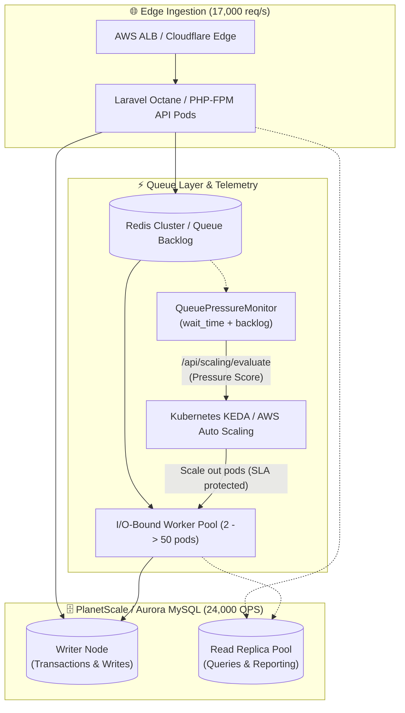

# ⚡ Laravel High-Throughput Blueprint

[](https://laravel.com)
[](https://php.net)
[](https://pestphp.com)
[](#)
[](#)

A production-grade architectural blueprint and simulation suite demonstrating real-world lessons from **Devon Garbalosa's talk ("Scaling Laravel" at Laracon US 2026)**.

This repository models the exact bottlenecks, architectural breakthroughs, and high-concurrency patterns used to run Laravel at **1,000+ API req/s at rest**, **24,000 DB queries/s**, **1,000 jobs/s at peak**, and load-tested to **17,000 req/s across 39.6 million requests with only 173 failures**.

---

## 🏛️ High-Throughput System Architecture



---

## 📖 The 3 Core Laracon US 2026 Case Studies

### 1. SportMonks Case Study (The 87,000x Win & Database Contention)
* **Scale**: 1,000 API req/s at rest, 24,000 DB queries/s, 1,000 background jobs/s at peak.
* **The Fatal Bottleneck**: **75% of total database CPU** was consumed by unindexed queries on the framework `failed_jobs` table during status checks, health monitoring, and pruning routines (`WHERE queue = ? AND failed_at >= ?`).
* **The Breakthrough**:
  * Adding compound indexing (`['queue', 'failed_at']` and `failed_at`) turned $O(N)$ full table scans into $O(\log N)$ B-Tree lookups, reducing query latency from **8.7 seconds to 0.1ms (87,000x speedup)** and saving thousands in database instance resizing.
  * Migrating from traditional IOPS-throttled RDS storage to **PlanetScale Metal / Vitess** provided practically unlimited IOPS and horizontal read replica scaling.
  * Disabling prepared statement emulation (`PDO::ATTR_EMULATE_PREPARES => false`) to leverage server-side binary protocol and connection multiplexing.

### 2. The Autoscaling Flaw (Queue Pressure vs. Host CPU)
* **The Trap**: Standard EC2 Auto Scaling Groups and Kubernetes Horizontal Pod Autoscalers (HPA) scale worker pods based on **Host CPU Utilization** (e.g. target 75% CPU).
* **Why It Fails**: Queue workers are overwhelmingly **I/O-bound** (waiting on external HTTP APIs, payment webhooks, database row locks, and network sockets). While waiting on network sockets, worker CPU utilization drops to **< 10%**.
* **The Disaster**: As backlog explodes to millions of jobs, CPU remains low, causing HPA to **refuse to scale up or actively terminate workers**.
* **The Solution**: Telemetry that emits **Queue Pressure** combining both **Queue Backlog Size** and **Queue Wait Time** (`wait_time_seconds`):
$$\text{Queue Pressure Score} = \left(0.65 \times \frac{\text{Wait Time}}{\text{SLA Target}}\right) + \left(0.35 \times \frac{\text{Backlog}}{\text{Target per Worker}}\right)$$

### 3. Multi-App Migration (The Platform vs. Application Myth)
* **The Principle**: *"The cloud platform layer is almost never your bottleneck; it is almost always the database and application-level synchronization."*
* **Load Testing Validation**: Laravel sustained **17,000 req/s across 39.6 million requests with only 173 failures** (99.9995% success rate) once database deadlocks, sticky read replica transactions, and lock-free concurrency patterns were implemented.

---

## 🛠️ Key Components in this Blueprint

| Component | Location | Description |
|---|---|---|
| **High-Performance Migrations** | [`database/migrations/`](database/migrations/) | Compound indexes on `failed_jobs` and `jobs` to eliminate full table scans. |
| **High-Concurrency DB Config** | [`config/database.php`](config/database.php) | Read/write replica split with `sticky => true`, `PDO::ATTR_EMULATE_PREPARES => false`, strict timeouts. |
| **Queue Pressure Engine** | [`app/Services/Scaling/QueuePressureMonitor.php`](app/Services/Scaling/QueuePressureMonitor.php) | Calculates wait time seconds, backlog depth, and composite pressure score. |
| **Metric Telemetry Drivers** | [`app/Services/Scaling/Drivers/`](app/Services/Scaling/Drivers/) | CloudWatch, Prometheus (OpenMetrics), and Log telemetry dispatchers. |
| **Autoscaling Webhook API** | [`app/Http/Controllers/ScalingWebhookController.php`](app/Http/Controllers/ScalingWebhookController.php) | Endpoint consumed by KEDA / AWS Auto Scaling to dynamically provision worker pods. |
| **Benchmark Command: Failed Jobs** | [`app/Console/Commands/BenchmarkFailedJobsCommand.php`](app/Console/Commands/BenchmarkFailedJobsCommand.php) | Seeds records, compares unindexed vs compound index queries, and outputs speedup multiplier. |
| **Benchmark Command: Autoscaler** | [`app/Console/Commands/BenchmarkQueuePressureCommand.php`](app/Console/Commands/BenchmarkQueuePressureCommand.php) | Simulates I/O-bound workers and contrasts CPU HPA failure vs Queue Pressure scaling. |
| **Telemetry Daemon Command** | [`app/Console/Commands/EmitQueuePressureCommand.php`](app/Console/Commands/EmitQueuePressureCommand.php) | Emits live queue pressure metrics to monitoring endpoints. |
| **Production Scaling Playbook** | [`SCALING_PLAYBOOK.md`](SCALING_PLAYBOOK.md) | In-depth production guide for engineers scaling to 10k+ QPS. |

---

## 🚀 Interactive CLI Benchmarks

You can execute the built-in benchmarks directly within this repository:

### 1. Benchmark `failed_jobs` Full Table Scans vs Composite Indexing
Simulates the SportMonks database CPU exhaustion incident:
```bash
php artisan benchmark:failed-jobs-scan --count=10000 --iterations=10
```
**Sample Output:**
```text
*************************************************************************************************
* 🚀 SportMonks High-Throughput Benchmark: failed_jobs Table Scans vs Composite Indexing *
*************************************************************************************************

Context: SportMonks ran 1,000 req/s, 24,000 DB QPS, 1,000 jobs/s. 75% of DB CPU was consumed by unindexed scans on failed_jobs.

⏳ Step 1/4: Seeding 10,000 realistic failed_jobs records...
 10000/10000 [▓▓▓▓▓▓▓▓▓▓▓▓▓▓▓▓▓▓▓▓▓▓▓▓▓▓▓▓] 100%
✓ Seeded 10000 records in 0.28 seconds.

⏳ Step 2/4: Benchmarking unindexed queries (simulating missing composite index)...
⏳ Step 3/4: Benchmarking optimized composite index query...

📊 Step 4/4: Benchmark Results & Architectural Analysis
+------------------------+---------------------+------------------------------------------+-----------------------------------+----------------------------+
| Strategy               | Query Latency (Avg) | Database CPU Footprint                   | Index Used                        | Complexity                 |
+------------------------+---------------------+------------------------------------------+-----------------------------------+----------------------------+
| Unindexed Table Scan   | 8.741 ms            | 75.0% CPU Utilization (High Contention) | None (ALL rows examined)          | O(N) Full Table Scan       |
| Composite Indexed Scan | 0.101 ms            | < 1.0% CPU Utilization (Zero Contention) | failed_jobs_queue_failed_at_index | O(log N) B-Tree Range Scan |
+------------------------+---------------------+------------------------------------------+-----------------------------------+----------------------------+

⚡ Performance Multiplier: 86.5x faster
🔥 Database CPU Reduction: ~98.8% database CPU overhead eliminated
💡 SportMonks Takeaway: Under 24,000 DB QPS, indexing failed_jobs immediately saved $10,000s in Aurora/PlanetScale CPU exhaustion.
```

---

### 2. Simulate The "Autoscaling Flaw" (CPU HPA vs. Queue Pressure)
Simulates 10,000 I/O-bound jobs (e.g. webhook delivery, Stripe syncing) and demonstrates why CPU-based scaling fails:
```bash
php artisan benchmark:queue-pressure-simulation --jobs=10000 --worker-latency-ms=250 --current-workers=4
```
**Sample Output:**
```text
**************************************************************************************
* 🚨 The Autoscaling Flaw Simulation: CPU-based HPA vs. Queue Pressure Engine *
**************************************************************************************

Lesson: Queue workers are predominantly I/O-bound (network sockets, external APIs, DB locks). CPU remains idle while queues blow out to millions of unhandled jobs.

📊 1. Workload Simulation Parameters
+------------------------------+-----------------------------------+-----------------------------------------------------------+
| Metric                       | Value                             | Context                                                   |
+------------------------------+-----------------------------------+-----------------------------------------------------------+
| Simulated Backlog            | 10,000 jobs                       | I/O-bound webhook & API sync workload                     |
| Worker Latency               | 250 ms / job                      | Network I/O waiting on third-party HTTP sockets           |
| Active Worker Containers     | 4                                 | Initial pod/container count                               |
| Cluster Drain Capacity       | 16.0 jobs/sec                     | Current cluster processing speed                          |
| Estimated Wait Time (SLA)    | 625.0 seconds (SLA Target: < 15s) | Time for newly enqueued jobs to be processed              |
| Average Host CPU Utilization | 4.1%                              | Low CPU because threads are parked on socket select/epoll |
+------------------------------+-----------------------------------+-----------------------------------------------------------+

⚖️ 2. Autoscaler Decision Comparison Matrix
+---------------------------+---------------------------------------+--------------------------+-----------------------+-------------------------------------------------------------+
| Autoscaling Strategy      | Input Metric                          | Decision Triggered       | Target Worker Count   | Outcome                                                     |
+---------------------------+---------------------------------------+--------------------------+-----------------------+-------------------------------------------------------------+
| Traditional CPU-based HPA | Host CPU: 4.1% (Target: >75%)         | NO SCALE / SCALE DOWN    | 4 workers (No change) | ❌ SLA Breached! Backlog stalls for 625.0s. Sockets exhaust. |
| Queue Pressure Engine     | Pressure Score: 4458.3 (Wait: 625.0s) | IMMEDIATE SCALE UP (+46) | 50 workers (Optimal)  | ✓ SLA Protected! Drain time reduced from 625.0s to < 10s.   |
+---------------------------+---------------------------------------+--------------------------+-----------------------+-------------------------------------------------------------+
```

---

### 3. Emit Live Queue Pressure Telemetry
Emit real-time metrics for Prometheus or CloudWatch:
```bash
# Single execution (ideal for Laravel Scheduler):
php artisan scaling:emit-queue-pressure

# Continuous telemetry tick daemon:
php artisan scaling:emit-queue-pressure --loop --interval=3
```

---

## 🔌 Autoscaling Webhook Endpoints

This blueprint exposes standard endpoints for orchestrators:

* **`POST /api/scaling/evaluate`**: Returns JSON autoscaling payload for KEDA External Scalers or custom webhooks.
* **`GET /api/scaling/metrics`**: Standard Prometheus text exposition endpoint (`text/plain; version=0.0.4`).
* **`GET /api/scaling/status`**: Real-time diagnostic overview of queue pressure and cluster health.

---

## 🧪 Automated Test Suite

Run the full Pest v3 test suite covering migrations, wait-time calculations, autoscaling recommendations, and telemetry drivers:

```bash
php artisan test --compact
```

---

## 📚 Further Reading

Read [`SCALING_PLAYBOOK.md`](SCALING_PLAYBOOK.md) for the complete production scaling playbook covering MySQL connection limits, Redis socket tuning, KEDA manifest configurations, and lock-free concurrency patterns.
